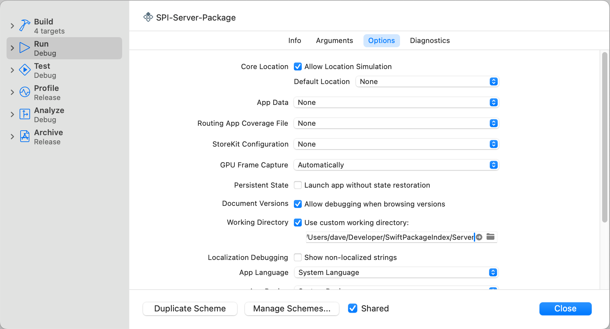

## Configuring a Local Development Environment

To run the project on your local machine, you'll need the [latest non-beta version of Xcode](https://developer.apple.com/xcode/resources/) and [Docker Desktop for macOS](https://www.docker.com/products/docker-desktop) installed.

It is not possible to run the [build system](https://blog.swiftpackageindex.com/posts/launching-language-and-platform-package-compatibility/) locally due to its reliance on the infrastructure in which it runs. If you have any feature requests or bug reports relating to the build or compatibility system, [please start a discussion](https://github.com/SwiftPackageIndex/SwiftPackageIndex-Server/discussions).

### Setup the Back End

Once you have the project cloned locally, the `Makefile` defines a set of useful commands to get you up and running.

You'll need some environment variables configured before you can run the project. There are template files in the repository as `.env.testing.template` and `.env.development.template` and your first step should be to copy these files as `.env.testing` and `.env.development` and review their content in case your setup deviates from the default.

Then, to create Postgres databases in Docker for your development and test environments, run:

```
make db-up
```

Then, to set up the schema and migrate the database to the latest version, run:

```
make migrate
```

Then, either run `make run` to start the server, or in most situations, you'll find working with Xcode easier at this stage. Open the project with Xcode and open the Product menu, select "Scheme" and "Manage Schemes…".


Then, select the "Run" scheme and click the "Edit…" button. Select the "Run" scheme action from the source list and switch to the "Options" tab. Find the "Working Directory" setting and tick "Use a custom working directory:", then select the directory where you have your working copy of the project.



Close the scheme editor, ensure that the "Run" scheme is selected in the Xcode toolbar and run the project with Xcode! When the development server starts, you should see this output in the Xcode console:

```
[ NOTICE ] Server starting on http://127.0.0.1:8080 [component: server]
```

**Note:** When working locally, it's helpful to have a database with pre-populated data from the live system. [Talk to us on Discord](https://discord.gg/vQRb6KkYRw), and we'll supply you with a recent database dump that you can load with `./scripts/load-db.sh`.

### Setup the Front End

Once the back end is set up and the server is running, the next step is to set up the front end to serve the CSS and JavaScript.

We use [yarn](https://yarnpkg.com) and [esbuild](https://esbuild.github.io) to build our front end files. However, you do not need to install `node` or `yarn` locally as the front end build scripts run through Docker. If you want to run a one-time build of the front end, so the site has valid CSS and JavaScript, run:

```shell
make build-front-end
```

If you want to set up the front end for active development, run a local front end server with:

```shell
make serve-front-end
```

If you make changes to front-end files, you'll need to lint them before committing them. Run a full CSS and JavaScript lint with:

```shell
make lint-front-end
```

Or, if you want to run either the CSS or JavaScript linting steps separately, run the `run-stylelint` or `run-prettier` commands individually. Versions of these commands also exist that can automatically fix common problems that cause the lint to fail. Run `make lint-front-end-auto-fix` to run both `run-stylelint-auto-fix` and `run-prettier-auto-fix` and fix all automatically fixable problems.

**Note:** If you are doing extensive work with the front end, you may want to install `node` and `yarn` locally rather than running them via Docker. You may also want to set up `stylelint` and `prettier` to run from within your code editor, rather than waiting for CI to find errors.

### Check Everything Works!

Navigate to `http://127.0.0.1:8080` with a web browser, and the site should be up and running locally with CSS and JavaScript working!

## Logging database queries

It can be helpful when working with code that makes database queries to see the SQL statements that execute as the app runs. You can switch on logging of _all_ executed SQL statements at our default log level by changing the value of the `sqlLogLevel` parameter from `.debug` to `.info` in the call to `app.databases.use` in `configure.swift`.

Once changed, SQL query logs will look like this:

```
[ INFO ] SELECT "packages"."id" AS "packages_id", "packages"."created_at" AS "packages_created_at", "packages"."updated_at" AS "packages_updated_at", "packages"."platform_compatibility" AS "packages_platform_compatibility", "packages"."processing_stage" AS "packages_processing_stage", "packages"."score" AS "packages_score", "packages"."status" AS "packages_status", "packages"."url" AS "packages_url", "repositories"."id" AS "repositories_id", "repositories"."created_at" AS "repositories_created_at", "repositories"."updated_at" AS "repositories_updated_at", "repositories"."forked_from_id" AS "repositories_forked_from_id", "repositories"."package_id" AS "repositories_package_id", "repositories"."authors" AS "repositories_authors", "repositories"."commit_count" AS "repositories_commit_count", "repositories"."default_branch" AS "repositories_default_branch", "repositories"."first_commit_date" AS "repositories_first_commit_date", "repositories"."forks" AS "repositories_forks", "repositories"."homepage_url" AS "repositories_homepage_url", "repositories"."is_archived" AS "repositories_is_archived", "repositories"."is_in_organization" AS "repositories_is_in_organization", "repositories"."keywords" AS "repositories_keywords", "repositories"."last_activity_at" AS "repositories_last_activity_at", "repositories"."last_commit_date" AS "repositories_last_commit_date", "repositories"."last_issue_closed_at" AS "repositories_last_issue_closed_at", "repositories"."last_pull_request_closed_at" AS "repositories_last_pull_request_closed_at", "repositories"."license" AS "repositories_license", "repositories"."license_url" AS "repositories_license_url", "repositories"."name" AS "repositories_name", "repositories"."open_issues" AS "repositories_open_issues", "repositories"."open_pull_requests" AS "repositories_open_pull_requests", "repositories"."owner" AS "repositories_owner", "repositories"."owner_name" AS "repositories_owner_name", "repositories"."owner_avatar_url" AS "repositories_owner_avatar_url", "repositories"."readme_url" AS "repositories_readme_url", "repositories"."readme_html_url" AS "repositories_readme_html_url", "repositories"."releases" AS "repositories_releases", "repositories"."stars" AS "repositories_stars", "repositories"."summary" AS "repositories_summary" FROM "packages" LEFT JOIN "repositories" ON "packages"."id" = "repositories"."package_id" WHERE "repositories"."owner" ilike $1 AND "repositories"."name" ilike $2 LIMIT 1 [Optional("daveverwer"), Optional("LeftPad")] [component: server, database-id: psql, request-id: 56DF427B-1B2D-46FD-9AED-68CDE3C52B7C] (FluentPostgresDriver/FluentPostgresDatabase.swift:29)
```

These statements can be executed in a SQL client once the `$variables` have been replaced with the values at the end of the log.

## Environment Variables

We check for the presence of some environment variables to control various aspects of building and testing:

| Environment variable | Description                                       |
| -------------------- | ------------------------------------------------- |
| GITHUB_WORKFLOW      | Enable/disable certain tests in a CI environment. |

## Reconciliation, Ingestion, and Analysis

> **NOTE:** This section provides background information about how this system collects package metadata from various sources (The Package manifest, git repository for the package, and GitHub), but it is not necessary to run these commands for most local development. If you plan to work on this specific part of the system, or if you're curious, please read on. However, restoring a copy of a fully populated database is best if you want to run the system locally. If you would like a recent database dump, please [talk to us on Discord](https://discord.gg/vQRb6KkYRw), and we'll supply you with one that you can load with `./scripts/load-db.sh`.

There are three main background processes responsible for adding/removing packages and keeping package metadata updated:

1. **Reconciliation** fetches the [package list](https://github.com/SwiftPackageIndex/PackageList) and reconciles it with the current list of packages, adding or deleting rows in the `packages` table.
2. **Ingestion** fetches metadata from GitHub (and potentially other hosting services in the future) and creates or updates rows in the `repositories` table.
3. **Analysis** clones/pulls the complete git history for packages and creates or replaces rows in the `versions` and `products` tables.

### Running Reconciliation and Ingestion Locally

**Note:** You will not need to run reconciliation, ingestion, or analysis locally unless you're working on these parts of the system.

The `ingest-loop.sh` script can serve as a simple way to run a full ingestion cycle:

```
make db-reset             # Delete and re-creating the development and test databases.
make reconcile            # Import all packages in the package list.
./scripts/ingest-loop.sh  # Ingest metadata for 100 packages, pause for 10 sec, and repeat.
```

If you want to run ingestion for anything other than a cursory test, you'll need to use authenticated GitHub API calls. To do this, set a `GITHUB_TOKEN` environment variable to a [generated personal token](https://github.com/settings/tokens) that has the `public_repo` and `repo:status` scopes.

### Running Analysis Locally

To run analysis locally for a single package, run:

```
make analyze
```

To analyse more than one package, use the `--limit` parameter.

**Note:** Analysis checks out repositories into your local file system. BY default, it will create and use a `SPI-checkouts` directory in your project's working directory, but you can change this location by setting the environment variable `CHECKOUTS_DIR` to another path.

### Running an end-to-end test

The `Makefile` also includes a command to run a full test of the server update process (reconciliation, ingestion, and analysis) processing just _one_ package. This is a good way to verify everything.

```
make test-e2e
```

## Running the Full Stack Locally

**Note:** You will not need to run the full stack locally unless you're working on debugging the hosting environment for the project.

The `app.yml` Docker compose file defines the application stack. The only other required component is the database which can be brought up via `make db-up-dev` and populated via the processing steps or with a database dump.

If you connect to a locally running database, make sure to specify the `DATABASE_HOST` variable as `host.docker.internal`, which is the hostname of the machine running Docker as seen from within a container and automatically configured by Docker's networking.

Set up any of the other required environment variables in an `.env` file and run

```
env VERSION=2.47.11 docker-compose -f app.yml up -d
```

to bring up the full stack. The `VERSION` variable references a tag name or a git SHA. You can either rely on Docker pulling a previously built image from the registry or build and tag a version you want to run locally:

```
$ make docker-build
No VERSION provided, defaulting to d64a881019662aced6fa0a3748b754dffa9fad29
docker build -t registry.gitlab.com/finestructure/swiftpackageindex:d64a881019662aced6fa0a3748b754dffa9fad29 .
Sending build context to Docker daemon  536.1MB
...
```

Use the logged `VERSION` for the `docker-compose` command.

Note that this will launch several services defined in `app.yml`, including the services that continuously process packages. In order to only run the Vapor app, run:

```
env VERSION=... docker-compose -f app.yml up -d server
```

## Running in a Linux container

Sometimes you need to run tests or even the server on the target platform, Linux. The best way to do that is to build and run in a Linux container.

The trickiest part of this is to ensure the test or app container can connect to the database, which is also running in docker. To do so, requires the following setup:

- in your `.env` file - `development` or `testing`, depending on whether you are running the server or the tests, set `DATABASE_HOST` to `host.docker.internal`
- on macOS, that's all you need to to. On Linux, you need to tell your `docker run` command to make the host accessible on the network via `--add-host=host.docker.internal:host-gateway`. (This works on macOS as well but is redundant.)

So, in order to run the tests in a Linux container run:

```
docker run --rm -v "$PWD":/host -w /host --add-host=host.docker.internal:host-gateway registry.gitlab.com/finestructure/spi-base:02ffeabd701ea48f35cd1634ef6450c232aa214a swift test
```

Make sure you use the most recent `spi-base` image. You can find the latest image name in the `test-docker` target, which also provides a convenient way to run all all tests in a docker container.

Running the tests in a separate command like above can be useful to run tests individually, via a `--filter <test selector>` parameter.
